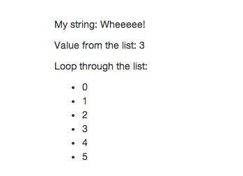
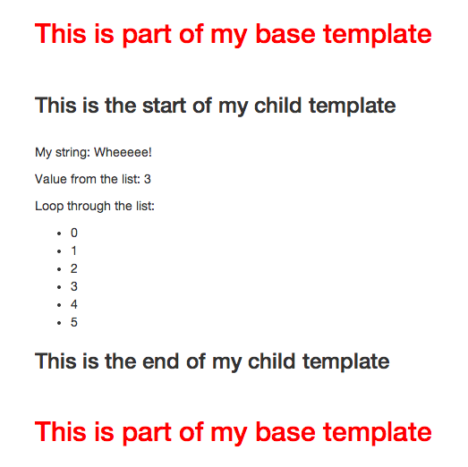
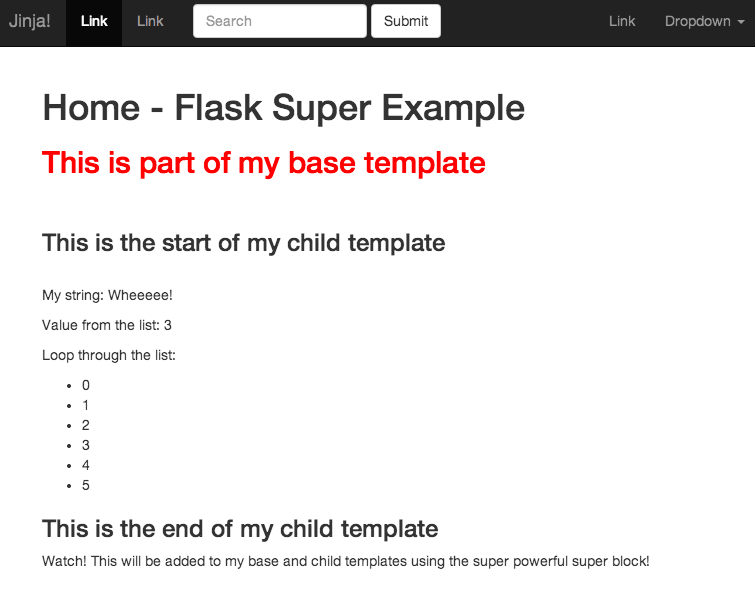
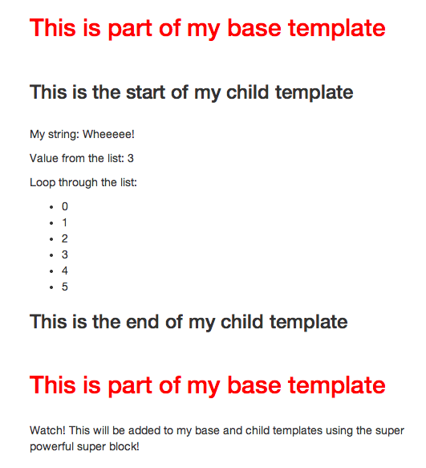
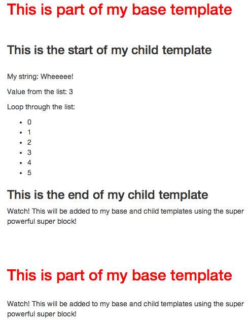
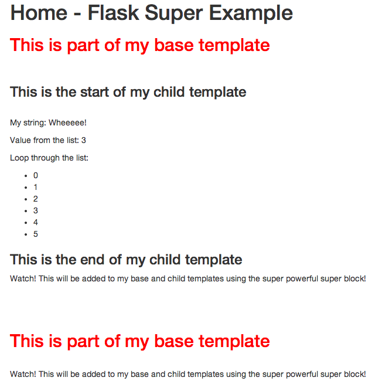
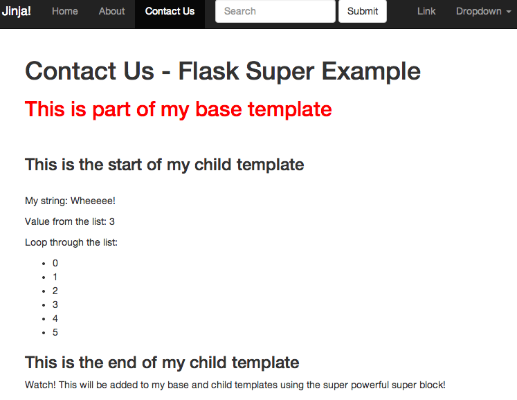
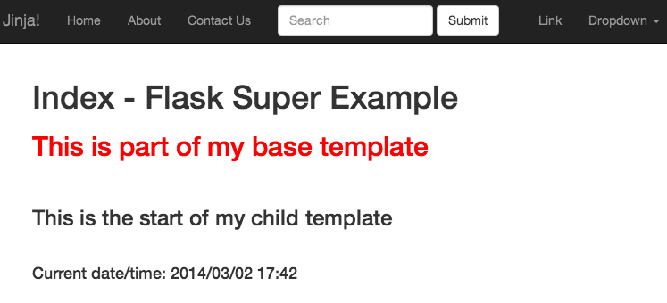

 # Primer on Jinja Templating

Right out of the box, Flask includes the powerful [Jinja](http://jinja.pocoo.org/docs/) templating language. It's modeled after Django templates (but it renders much faster) and, although, Flask does not force you to use any templating language, it assumes that you'll be using Jinja since it does come pre-installed.

For those who have not been exposed to a templating language before, such languages essentially contain variables as well as some programming logic, which when evaluated (or rendered into HTML) is replaced with **actual** values. The variables and/or logic are placed between tags or delimiters. For example, Jinja templates use `` for expressions or logic (like for loops), while `{{ ... }}` are used for outputting the results to the end user. The latter tag, when rendered, is replaced with a value or values, and are seen by the end user.

> Jinja Templates are just .html files. By convention they live in the "/templates" directory in a Flask project.

## Quick Examples

Make sure you have Jinja installed before running these examples - `pip install jinja2`

```sh
>>> from jinja2 import Template
>>> t = Template("Hello {{ something }}!")
>>> t.render(something="World")
u'Hello World!'
>>>
>>> t = Template("My favorite numbers: {{n}} " "")
>>> t.render()
u'My favorite numbers: 1 2 3 4 5 6 7 8 9 '
```

Notice how the actual output rendered to the user falls within the `{{ ... }}` tags.

## Flask Examples

1. Create the following project structure:
  ```sh
  ├── requirements.txt
  ├── run.py
  └── templates
  ```

2. Activate a virtualenv then install flask:
  ```sh
  $ pip install flask
  ```

3. Add the following code to *run.py*:
  ```python
  from flask import Flask, render_template
  app = Flask(__name__)


  @app.route("/")
  def template_test():
      return render_template('template.html', my_string="Wheeeee!", my_list=[0,1,2,3,4,5])


  if __name__ == '__main__':
      app.run(debug=True)
  ```

  Here we are establishing the route `/`, which renders the template `template.html` via the function `render_template()`. This function must have a template name. Optionally, you can pass in arguments to the template, like in the example - `my_string` and `my_list`. 


4. Add the template:
  ```html
  <!DOCTYPE html>
  <html>
    <head>
      <title>Flask Template Example</title>
      <meta name="viewport" content="width=device-width, initial-scale=1.0">
      <link href="http://netdna.bootstrapcdn.com/bootstrap/3.0.0/css/bootstrap.min.css" rel="stylesheet" media="screen">
      <style type="text/css">
        .container {
          max-width: 500px;
          padding-top: 100px;
        }
      </style>
    </head>
    <body>
      <div class="container">
        <p>My string: {{my_string}}</p>
        <p>Value from the list: {{my_list[3]}}</p>
        <p>Loop through the list:</p>
        <ul>
          
          <li>{{n}}</li>
          
        </ul>
      </div>
      <script src="http://code.jquery.com/jquery-1.10.2.min.js"></script>
      <script src="http://netdna.bootstrapcdn.com/bootstrap/3.0.0/js/bootstrap.min.js"></script>
    </body>
  </html>
  ```

  Save this as *template.html* in the templates directory. Notice the template tags. Can you guess the output before you run the app?

5. Run the app:
  ```sh
  $ python run.py
  ```

  You should see:

  

6. It's worth noting that Jinja only supports a few control structures - `if`-statements and `for`-loops are the two primary structures. The syntax is similar to Python, differing in that no colon is required and that termination of the block is done using an `endif` or `endfor` instead of by whitespace. You can also complete the logic within your controller or views and then pass each value to the template using the template tags. However, it is much easier to perform such logic within the templates themselves.

## Inheritance

Templates usually take advantage of [inheritance](http://jinja.pocoo.org/docs/templates/#template-inheritance), which includes a single base template that defines the basic structure of all subsequent child templates. You use the tags  and  to implement inheritance.

The use case for this is simple: as your application grows, and you continue adding new templates, you will need to keep common code (like a HTML navigation bar, Javascript libraries, CSS stylesheets, and so forth) in sync, which can be a lot of work. Using inheritance, we can move those common pieces to a parent template so that we can create or edit such code one and all child templates will inherent such code.

Let's add inheritance to our example.

1. Create the base (or parent) template:
  ```html
<!DOCTYPE html>
<html>
  <head>
    <title>Flask Template Example</title>
    <meta name="viewport" content="width=device-width, initial-scale=1.0">
    <link href="http://netdna.bootstrapcdn.com/bootstrap/3.0.0/css/bootstrap.min.css" rel="stylesheet" media="screen">
    <style type="text/css">
      .container {
        max-width: 500px;
        padding-top: 100px;
      }
      h2 {color: red;}
    </style>
  </head>
  <body>
    <div class="container">
      <h2>This is part of my base template</h2>
      <br>
      
      <br>
      <h2>This is part of my base template</h2>
    </div>
    <script src="http://code.jquery.com/jquery-1.10.2.min.js"></script>
    <script src="http://netdna.bootstrapcdn.com/bootstrap/3.0.0/js/bootstrap.min.js"></script>
  </body>
</html>
  ```

  Save this as *layout.html*.

  Did you notice the `` tags? This defines a block (or area) that child templates can fill in. Further, this just informs the templating engine that a child template may override the block of the template. 

  > Think of these as placeholders to be filled in by code from the child template(s).

  Let's do that.

2. Update *template.html*:
  ```html
  
  
    <h3> This is the start of my child template</h3>
    <br>
    <p>My string: {{my_string}}</p>
    <p>Value from the list: {{my_list[3]}}</p>
    <p>Loop through the list:</p>
    <ul>
      
      <li>{{n}}</li>
      
    </ul>
    <h3> This is the end of my child template</h3>
  
  ```

  So, the `` informs the templating engine that this template "extends" another template, *layout.html*. This establishes the link between the templates, in other words.

3. Run it. You should see:

  

  One common use case is to add a navigation bar.

4. Add the following code to the base template, just after the opening `<body>` tag:
```html
  <nav class="navbar navbar-inverse" role="navigation">
    <div class="container-fluid">
      <div class="navbar-header">
        <button type="button" class="navbar-toggle" data-toggle="collapse" data-target="#bs-example-navbar-collapse-1">
          <span class="sr-only">Toggle navigation</span>
          <span class="icon-bar"></span>
          <span class="icon-bar"></span>
          <span class="icon-bar"></span>
        </button>
        <a class="navbar-brand" href="/">Jinja!</a>
      </div>

      <div class="collapse navbar-collapse" id="bs-example-navbar-collapse-1">
        <ul class="nav navbar-nav">
          <li class="active"><a href="#">Link</a></li>
          <li><a href="#">Link</a></li>
        </ul>
        <form class="navbar-form navbar-left" role="search">
          <div class="form-group">
            <input type="text" class="form-control" placeholder="Search">
          </div>
          <button type="submit" class="btn btn-default">Submit</button>
        </form>
        <ul class="nav navbar-nav navbar-right">
          <li><a href="#">Link</a></li>
          <li class="dropdown">
            <a href="#" class="dropdown-toggle" data-toggle="dropdown">Dropdown <b class="caret"></b></a>
            <ul class="dropdown-menu">
              <li><a href="#">Action</a></li>
              <li><a href="#">Another action</a></li>
              <li><a href="#">Something else here</a></li>
              <li class="divider"></li>
              <li><a href="#">Separated link</a></li>
            </ul>
          </li>
        </ul>
      </div><!-- /.navbar-collapse -->
    </div><!-- /.container-fluid -->
  </nav>
  ```

  Now every single child template that extends from the base, will have the same navigation bar. To steal a line from Java philosophy: "Write once, use anywhere."

  

## Super Blocks

If you need to render a block from the base template, use the a [super block](http://jinja.pocoo.org/docs/templates/#super-blocks) - `{{ super() }}`.

1. Add a footer to the base template:

  ```python
  <div class="footer">
    
      Watch! This will be added to my base and child templates using the super powerful super block!
      <br>
      <br>
    
  </div>
  ```

  Updated code:

  ```python
<!DOCTYPE html>
  <html>
    <head>
      <title>Flask Template Example</title>
      <meta name="viewport" content="width=device-width, initial-scale=1.0">
      <link href="http://netdna.bootstrapcdn.com/bootstrap/3.0.0/css/bootstrap.min.css" rel="stylesheet" media="screen">
      <style type="text/css">
        .container {
          max-width: 500px;
          padding-top: 100px;
        }
        h2 {color: red;}
      </style>
    </head>
    <body>
      <div class="container">
        <h2>This is part of my base template</h2>
        <br>
        
        <br>
        <h2>This is part of my base template</h2>
        <br>
        <div class="footer">
          
            Watch! This will be added to my base and child templates using the super powerful super block!
            <br>
            <br>
            <br>
          
        </div>
      </div>
      <script src="http://code.jquery.com/jquery-1.10.2.min.js"></script>
      <script src="http://netdna.bootstrapcdn.com/bootstrap/3.0.0/js/bootstrap.min.js"></script>
    </body>
  </html>
  ```

2. Run the app. You should see that the footer is just part of the base:

  

3. Now, add the super block to *template.html*
  ```python
  
  
    <h3> This is the start of my child template</h3>
    <br>
    <p>My string: {{my_string}}</p>
    <p>Value from the list: {{my_list[3]}}</p>
    <p>Loop through the list:</p>
    <ul>
      
      <li>{{n}}</li>
      
    </ul>
    <h3> This is the end of my child template</h3>
    
    {{super()}}
    
  
  ```

4. Check it out in your browser:

  

5. The super block is used for common code that both the parent and child templates share, such as the `<title>` where both templates share part of the title, then you would just need to pass in the other part. Or for a heading. 
For example:

  **Parent**

  ```html
  
    <h1> - Flask Super Example</h1>
  
  ```

  **Child**

  ```html
  Home
  
    {{ super() }}
  
  ```

  Let's see that in action:

  

  See what happens when you remove `Home` from the child template

  Try to update the `<title>` using the same method with the super block. Check out my code if you need help.

  Instead of hard coding the name of the template, let's make it dynamic. 

6. Update the two code snippets in *template.html*: 
  ```html
  {{title}}
  ```

  and

  ```html
  {{title}}
  ```

7. Now we need to pass in a `title` variable to our template from our controller, *run.py*:
  ```python
  @app.route("/")
  def template_test():
      return render_template('template.html', my_string="Wheeeee!", my_list=[0,1,2,3,4,5], title="Home")
  ```

  Test this out.

## Macros

In Jinja2, we can place commonly used code snippets that are used over and over to not repeat ourselves. It's common to highlight the link of the current page on the navigation bar (active link). We'd have to use if/elif/else statements to determine the active link. Using [macros](http://jinja.pocoo.org/docs/templates/#macros), we can abstract out such code into a separate file. 

1. Add a *macros.html* file to the "templates" directory:
  ```html
  
  
    <li class="active"><a href="{{ url_for(endpoint) }}">{{name}}</a></li>
  
    <li><a href="{{ url_for(endpoint) }}">{{name}}</a></li>
  
  
  ```

  Here, we're using Flask's request object, which is part of Jinja by default, to check the requested endpoint, then assigning the `active` class to that endpoint. 

2. Update the unordered list with the `nav navbar-nav` class in the base template
  ```html
  <ul class="nav navbar-nav">
    {{ nav_link('home', 'Home') }}
    {{ nav_link('about', 'About') }}
    {{ nav_link('contact', 'Contact Us') }}
  </ul>
  ```

  Also, make sure to add the import at the top of the template: ``.

  Notice how we're calling the `nav-link` macro and passing it two arguments, the endpoint (which comes from our controller) and the text we want displayed.

3. Finally, let's add three new endpoints to the controller:
  ```python
  @app.route("/home")
  def home():
      return render_template('template.html', my_string="Wheeeee!", my_list=[0,1,2,3,4,5], title="Home")

  @app.route("/about")
  def about():
      return render_template('template.html', my_string="Wheeeee!", my_list=[0,1,2,3,4,5], title="About")

  @app.route("/contact")
  def contact():
      return render_template('template.html', my_string="Wheeeee!", my_list=[0,1,2,3,4,5], title="Contact Us")
  ```

4. Refresh the page. Test out the links at the top. Does the current page get highlighted? It should.

  

## Custom filters

Jinja uses [filters](http://jinja.pocoo.org/docs/templates/#filters) to modify variables, mostly for formatting purpose.

For example:

```python
{{ num | round }}
```

This will round the `num` variable. So, if we pass argument `num=46.99` into the template, `47.0` will be outputted.

As you can tell, you specify the variable then a pipe (|) followed by the filter. Check out this [link](http://jinja.pocoo.org/docs/templates/#builtin-filters) for the list of filters already included within Jinja. In some cases, you can specify optional arguments in parentheses.

For example:

```python
{{ list|join(', ') }}
```

This will join a list by the comma delimiter.

Test this out. Add the following line to *template.html*

```python
<p>Same list with a filter: {{ my_list|join(', ') }}</p>
```

Now, besides the built-in filters, we can create our [own](http://jinja.pocoo.org/docs/api/#custom-filters).

Let's add one of our own. One common example is a custom datetime filter.

1. Add the following code to our controller after we create the app - `app = Flask(__name__)`:
  ```python
  @app.template_filter()
  def datetimefilter(value, format='%Y/%m/%d %H:%M'):
      """convert a datetime to a different format."""
      return value.strftime(format)

  app.jinja_env.filters['datetimefilter'] = datetimefilter
  ```

  Using the `@app.template_filter()` decorator we are registering the `datetimefilter()` function as a filter. 

  > The default name for the filter is just the name of the function; however, you can customize it by passing in an argument to the function - e.g, `@app.template_filter(formatdate)`.

  Next, we are adding the filter to the Jinja environment, making it accessible. Now it's ready for use.

2. Add the following code to our child template:
  ```html
  <h4>Current date/time: {{ current_time | datetimefilter }}</h4>
  ```

3. Finally, just pass in the datetime to our template:
   ```python
   current_time=datetime.datetime.now()
   ```

4. Test.

  


## Conclusion

That's it. Grab the sample code [here](https://github.com/cursor-education/python-course-alphabet/tree/master/template_language/flask_example).
